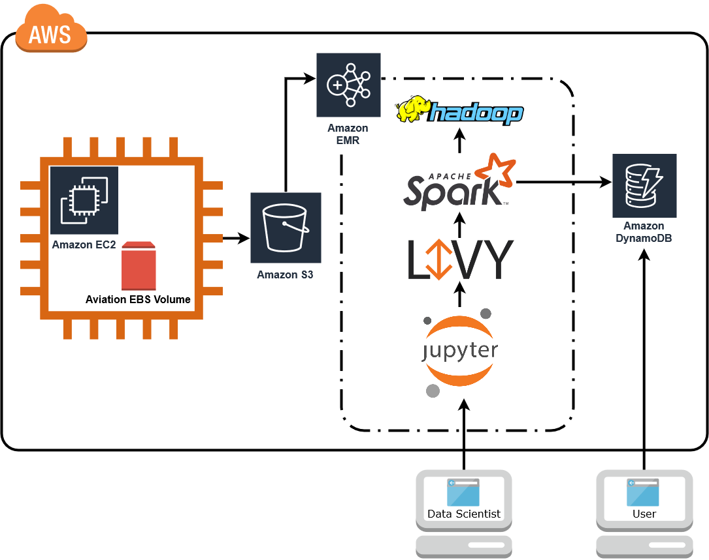

# Distributed Stream Processing, Systems Integration, and Cloud Services Applied to Flight Analytics

Conducting business and providing services generates a large volume of data, and the airline industry is no exception. While recording, storing, and processing this data can be challenging significant value can be captured for both the business and its customers by doing so. With the use of distributed computing, systems integration, and cloud services this can be achieved with relative ease and modest budget. This paper presents such an approach that leverages Apache Spark, an open-source distributed general-purpose cluster-computing framework, and the commercially available cloud computing service Amazon Web Services (AWS) to analyze a dataset from the Bureau of Transportation Statistics of all domestic flights in the US between 1988 and 2008. This paper will specifically use Spark Streaming, the stream processing capability of the framework, in order to continuously query a dataset that grows over time and compare the experience to traditional batch processing. A wide range of analytics can be conducted using these commodity tools and this paper provides a number of examples including popularity of airports, on-time departure performance of airlines and airports, and optimal flight routes given arbitrary constraints.

## Video

## Report

[PDF](Distributed%20Stream%20Processing,%20Systems%20Integration,%20and%20Cloud%20Services%20Applied%20to%20Flight%20Analytics.pdf)

## Architecture

